# Spesifikasi Diagram RBAC Lengkap (Bab IV Skripsi)
## E-Portal Universitas Ibn Khaldun Bogor (UIKA)

Dokumen ini berisi daftar lengkap diagram dengan format **Mermaid Script** untuk seluruh diagram Bab IV yang dirujuk dalam naskah skripsi `Skripsi_RBAC_Final_Updated.docx`. 

Semua diagram disesuaikan secara khusus untuk ruang lingkup (**Scope: RBAC Murni**) tanpa menyertakan alur SSO. Anda dapat menyalin (copy-paste) kode Mermaid di bawah ini ke editor pilihan Anda (misalnya [Mermaid Live Editor](https://mermaid.live)).

---

## 📊 DAFTAR DIAGRAM BAB IV

| No Gambar | Nama Diagram di Skripsi | Jenis Diagram | Status di Dokumen ini |
|---|---|---|---|
| **Gambar 4.1** | Diagram Sistem yang Sedang Berjalan | Flowchart | Ready (Mermaid) |
| **Gambar 4.2** | Diagram Sistem yang Diusulkan | Flowchart | Ready (Mermaid) |
| **Gambar 4.3** | Arsitektur Sistem RESTful Client-Server E-Portal UIKA | Block Diagram | Ready (Mermaid) |
| **Gambar 4.4** | Use Case Diagram Modul App Modules | Use Case | Ready (Mermaid) |
| **Gambar 4.5** | Use Case Diagram Modul Roles (Manajemen Peran) | Use Case | Ready (Mermaid) |
| **Gambar 4.6** | Use Case Diagram Modul Permissions (Manajemen Hak Akses) | Use Case | Ready (Mermaid) |
| **Gambar 4.7** | Use Case Diagram Modul Hak Akses (Role-Permission Mapping) | Use Case | Ready (Mermaid) |
| **Gambar 4.8** | Use Case Diagram Terintegrasi Sistem RBAC E-Portal UIKA | Use Case | Ready (Mermaid) |
| **Gambar 4.9** | Activity Diagram Login dan Otorisasi | Activity | Ready (Mermaid) |
| **Gambar 4.10** | Activity Diagram Manajemen Role | Activity | Ready (Mermaid) |
| **Gambar 4.11** | Activity Diagram Manajemen Permission | Activity | Ready (Mermaid) |
| **Gambar 4.12** | Class Diagram Modul RBAC | Class | Ready (Mermaid) |
| **Gambar 4.13** | Sequence Diagram Autentikasi dan Otorisasi | Sequence | Ready (Mermaid) |
| **Gambar 4.14** | Component Diagram Arsitektur RBAC | Component | Ready (Mermaid) |
| **Gambar 4.15** | Deployment Diagram Infrastruktur Sistem E-Portal UIKA | Deployment | Ready (Mermaid) |
| **Gambar 4.16** | ERD Basis Data RBAC | ERD | Ready (Mermaid) |

---

### Gambar 4.1: Diagram Sistem yang Sedang Berjalan (Flowchart)
Diagram ini memodelkan proses verifikasi hak akses di sistem lama yang masih terdesentralisasi, ad-hoc, dan tidak konsisten.

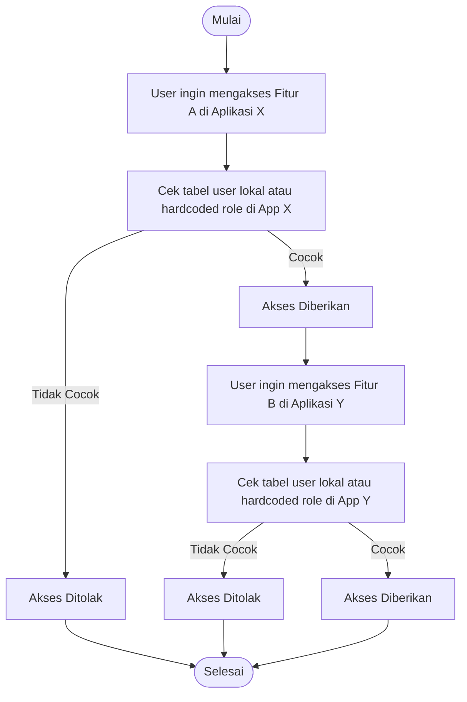

---

### Gambar 4.2: Diagram Sistem yang Diusulkan (Flowchart)
Diagram ini memodelkan alur akses tersentralisasi menggunakan RBAC dan JWT Token yang divalidasi oleh E-Portal.

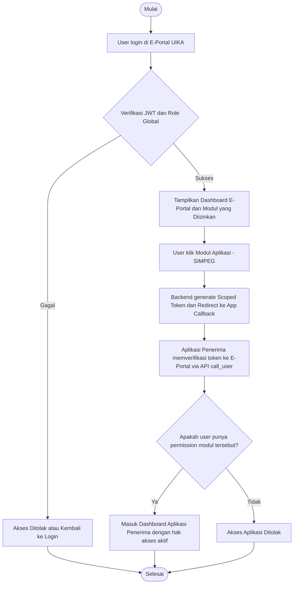

---

### Gambar 4.3: Arsitektur Sistem RESTful Client-Server E-Portal UIKA (Block Diagram)
Menampilkan pemisahan tanggung jawab antara Client-Side (React) dan Server-Side (Laravel API) serta interaksi dengan Database MySQL.

```mermaid
graph LR
    subgraph ClientNode ["Client Side - Vite dan React JS"]
        ReactApp["React UI Components - Tailwind, Lucide Icons"]
        AuthCtx["AuthContext - Session and Profile State"]
        Axios["Axios HTTP Client - Bearer Token Interceptor"]
        ReactApp --> AuthCtx
        AuthCtx --> Axios
    end

    subgraph ServerNode ["Server Side - Laravel REST API"]
        Router["API Routing and Middleware - jwt.verify, role admin"]
        Controllers["Controllers - User, Role, Permission"]
        Services["Services and Repositories - UserAdminService, ActivityLog"]
        Spatie["Spatie Permission Engine - HasRoles, HasPermissions"]
        
        Router --> Controllers
        Controllers --> Services
        Services --> Spatie
    end

    subgraph DbNode ["Database Side - MySQL"]
        MySQL["e_portal_db - users, roles, permissions, tx_user_module_permission"]
    end

    Axios -->|HTTP Requests atau JSON| Router
    Router -->|JSON Response| Axios
    Spatie -->|SQL Queries PDO| MySQL
```

---

### Gambar 4.4: Use Case Diagram Modul App Modules
Pemodelan fungsionalitas pengelolaan modul aplikasi oleh Administrator.

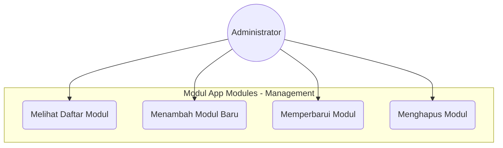

---

### Gambar 4.5: Use Case Diagram Modul Roles (Manajemen Peran)
Pemodelan fungsionalitas manajemen peran dan penetapan peran ke pengguna.

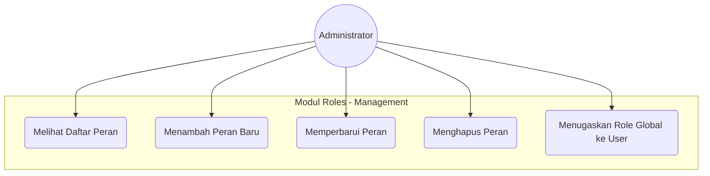

---

### Gambar 4.6: Use Case Diagram Modul Permissions (Manajemen Hak Akses)
Pemodelan fungsionalitas pengelolaan izin akses modular yang mencakup operasi massal (bulk).

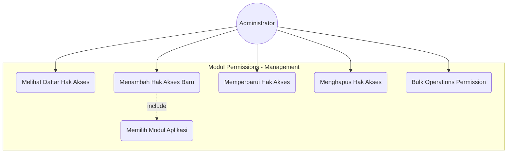

---

### Gambar 4.7: Use Case Diagram Modul Hak Akses (Role-Permission Mapping)
Pemodelan matriks relasional yang menyatukan permission dan role.

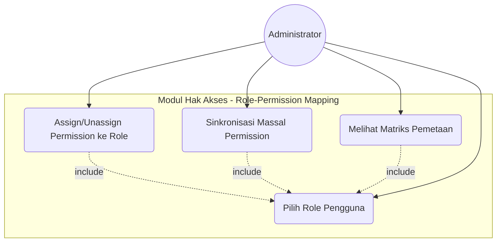

---

### Gambar 4.8: Use Case Diagram Terintegrasi Sistem RBAC E-Portal UIKA
Diagram use case lengkap yang memetakan seluruh aktivitas aktor Administrator dan Pengguna Biasa.

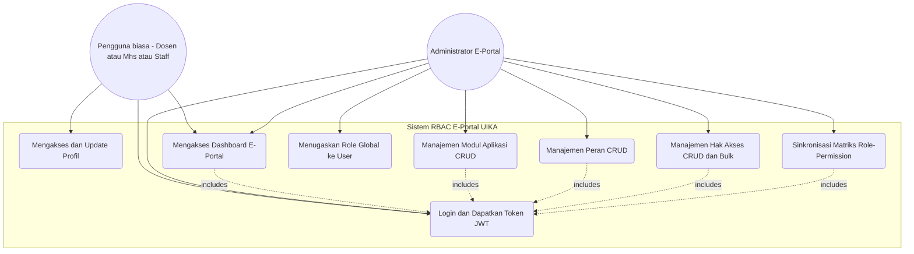

---

### Gambar 4.9: Activity Diagram Login dan Otorisasi (Activity)
Menggambarkan alur aktivitas proses login pengguna dan penerbitan JWT di sistem.

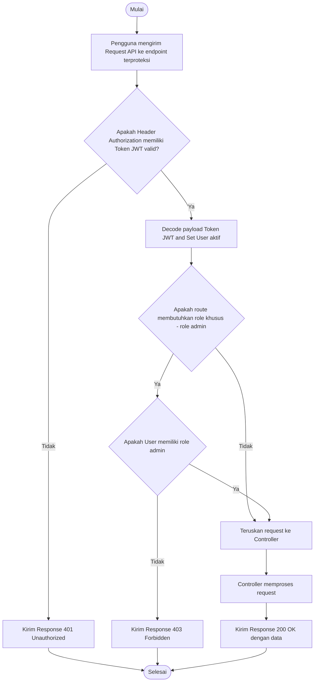

---

### Gambar 4.10: Activity Diagram Manajemen Role (Activity)
Menggambarkan logika internal proses manipulasi data role oleh Admin.

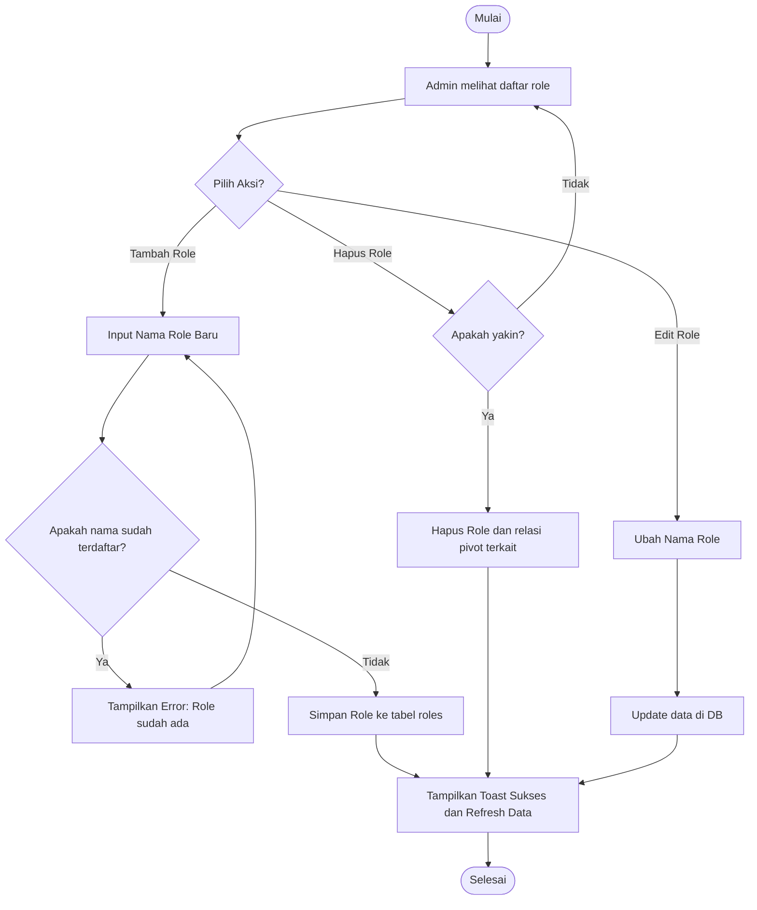

---

### Gambar 4.11: Activity Diagram Manajemen Permission (Activity)
Alur proses CRUD permission modular, baik operasi tunggal maupun bulk.

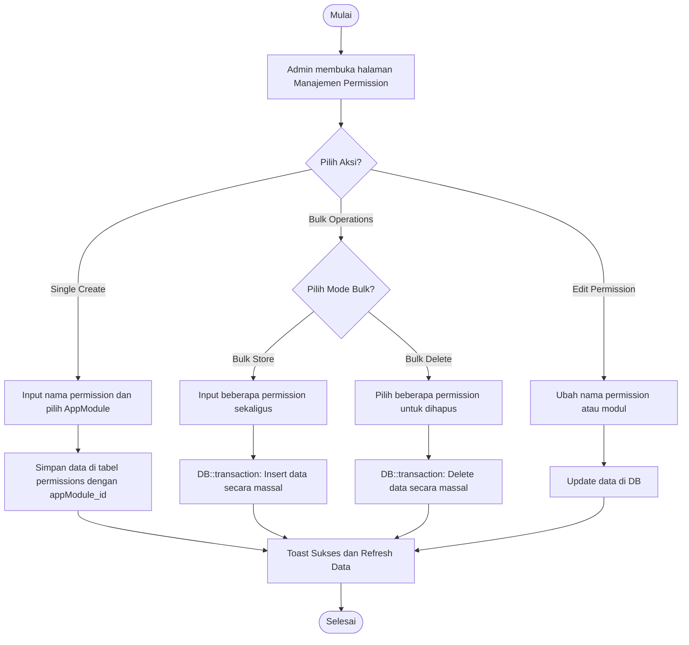

---

### Gambar 4.12: Class Diagram Modul RBAC (Class Diagram)
Definisi model-model Laravel untuk otorisasi dan hubungannya dengan React JS Frontend.

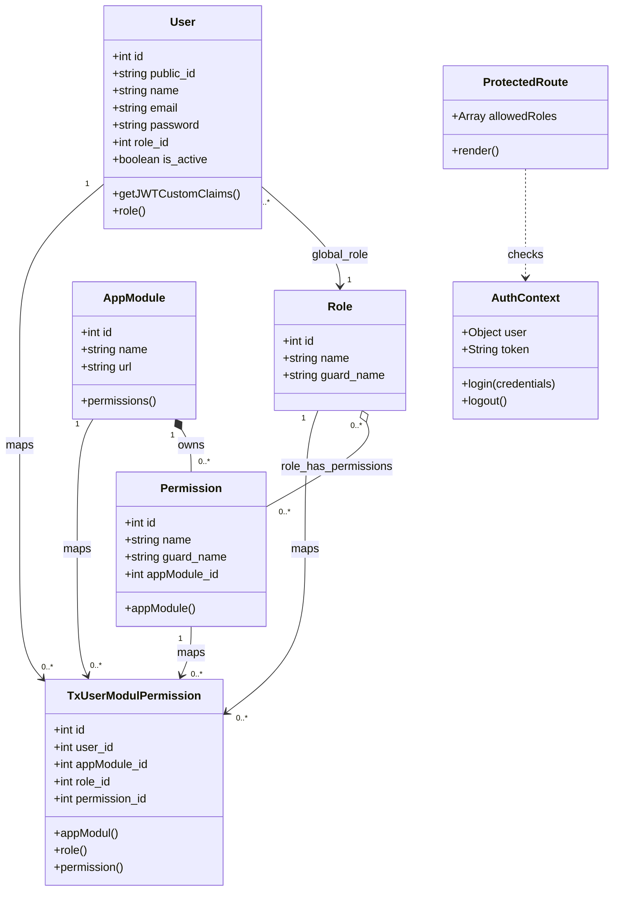

---

### Gambar 4.13: Sequence Diagram Autentikasi dan Otorisasi (Sequence)
Menggambarkan interaksi run-time berurutan antara browser client, server routing, middleware, controller, dan database.

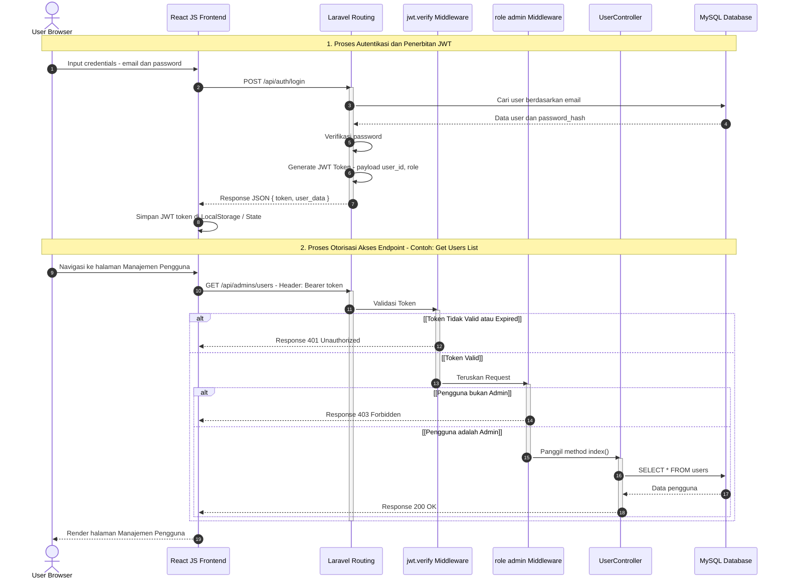

---

### Gambar 4.14: Component Diagram Arsitektur RBAC (Component)
Menampilkan relasi dependensi komponen frontend React dan arsitektur backend Laravel.

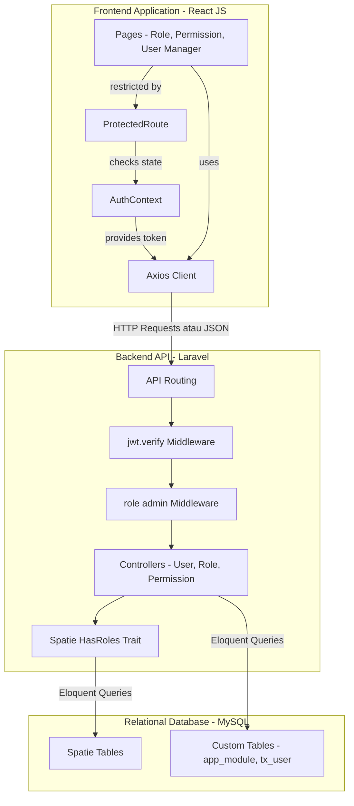

---

### Gambar 4.15: Deployment Diagram Infrastruktur Sistem E-Portal UIKA (Deployment)
Infrastruktur fisik runtime aplikasi saat proses development/development server local.

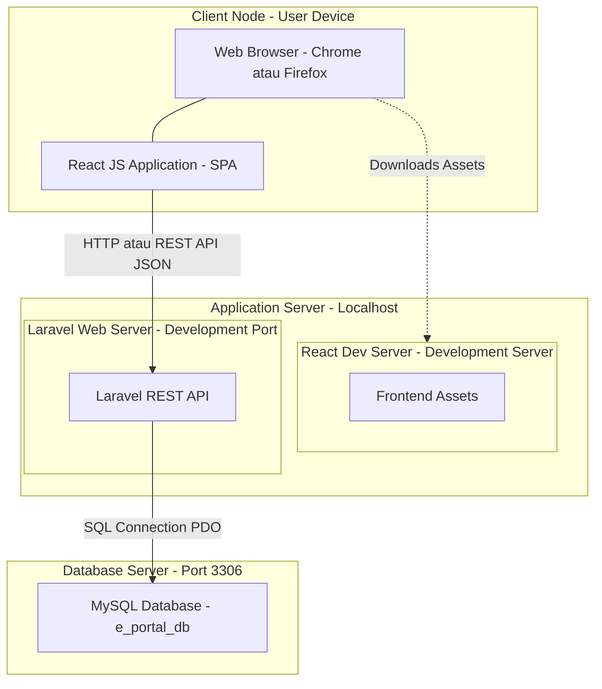

---

### Gambar 4.16: ERD Basis Data RBAC (ERD)
Skema relasional basis data relasional MySQL untuk menyimpan Spatie Permission terintegrasi AppModule.

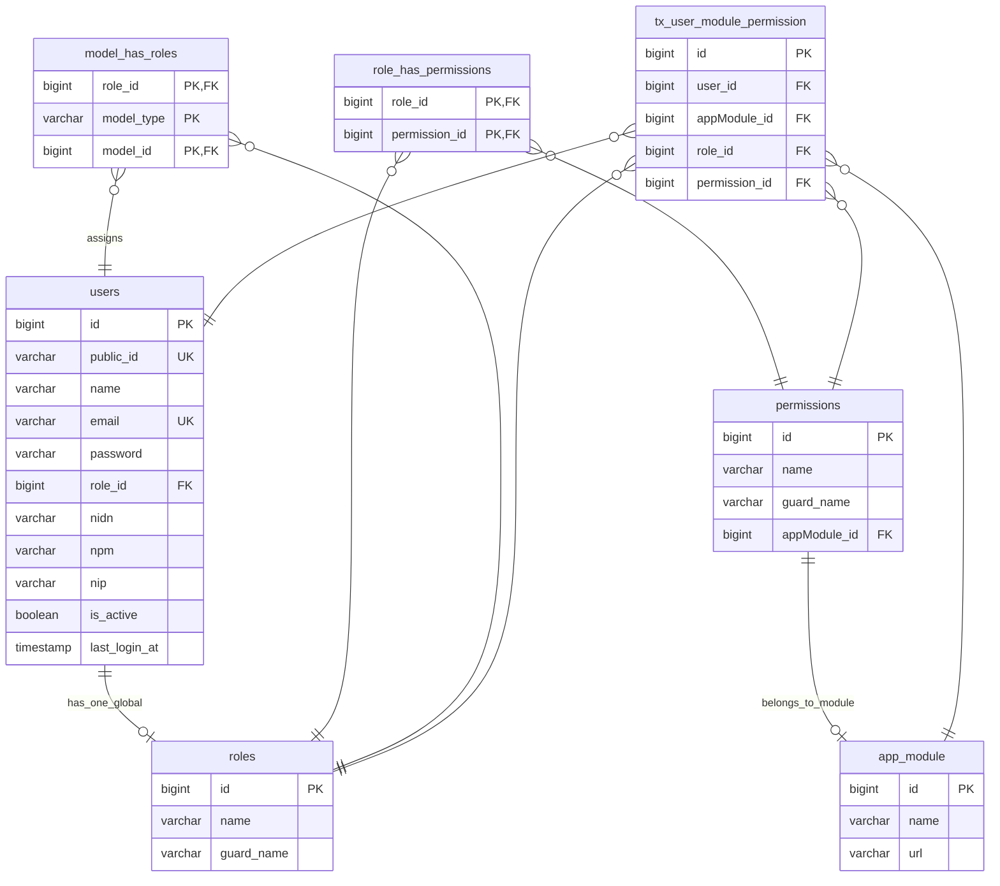
