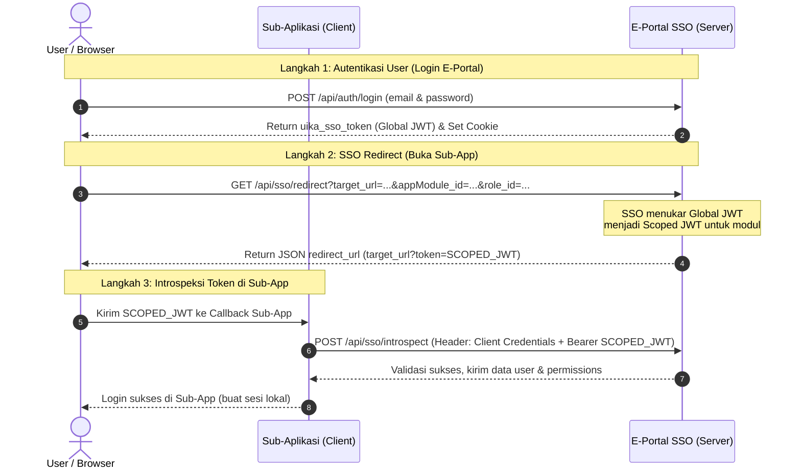

# 📡 SSO E-Portal UIKA — API Testing & Integration Guide

Dokumen ini berisi panduan terstruktur dan lengkap untuk melakukan testing API pada sistem SSO E-Portal Universitas Ibn Khaldun (UIKA) Bogor. Panduan ini mencakup endpoint **Login**, **SSO Redirect**, dan **SSO Introspect**.

Untuk mempermudah pengujian, kami juga menyediakan file testing interaktif [sso_testing.http](file:///c:/website/laravel/e-portal-uika-main/sso_testing.http) yang dapat dijalankan langsung di VS Code menggunakan extension **REST Client**.

---

## 🗺️ Alur Autentikasi SSO UIKA

Berikut adalah visualisasi bagaimana token dialirkan di dalam sistem SSO E-Portal UIKA:



---

## ⚙️ Environment Pengujian

Gunakan nilai default berikut untuk lingkungan lokal/development:

| Variable | Nilai Lokal | Nilai Production | Keterangan |
|---|---|---|---|
| **Base URL** | `http://localhost:8000` | `https://sso.uika-bogor.ac.id` | Server utama SSO E-Portal |
| **App Module ID** | `4` | *(Tergantung Modul)* | ID Modul sub-aplikasi (misal: 4 = SIAKAD) |
| **Role ID** | `2` | *(Tergantung Role)* | ID Role kontekstual (misal: 2 = Dosen) |
| **Client ID** | *(Dari database/seeder)* | *(Diberikan Admin)* | Client UUID untuk sub-aplikasi |
| **Client Secret** | *(Dari database/seeder)* | *(Diberikan Admin)* | Client Secret untuk sub-aplikasi |

> [!TIP]
> **Kredensial Akun Testing Default (Seeded):**
> *   **Admin:** `admin@gmail.com` / `password` (Role ID: 1)
> *   **Dosen:** `dosen@gmail.com` / `password` (Role ID: 2)
> *   **Mahasiswa:** `mahasiswa@gmail.com` / `password` (Role ID: 3)
> *   **User Biasa:** `user@gmail.com` / `password` (Role ID: 4)

---

## 📑 Referensi API Endpoints

### 1. User Login (Global Auth)
Endpoint ini digunakan oleh user untuk masuk ke sistem utama E-Portal menggunakan email dan password. Response akan mengembalikan **Global JWT Token** yang dapat digunakan untuk masuk ke sub-aplikasi lain.

*   **URL:** `/api/auth/login`
*   **Method:** `POST`
*   **Headers:**
    *   `Content-Type: application/json`
    *   `Accept: application/json`

#### Request Body
```json
{
  "email": "dosen@gmail.com",
  "password": "password"
}
```

#### Response (Success - 200 OK)
Selain mengembalikan JSON body, endpoint ini juga secara otomatis men-set cookie secure HTTP-Only `uika_sso_token`.
```json
{
  "status": 200,
  "success": true,
  "message": "Login successful",
  "data": {
    "user": {
      "id": 2,
      "name": "Dr. Ahmad Dosen, M.T.",
      "email": "dosen@gmail.com",
      "phone": "081234567891",
      "email_verified_at": "2026-05-26T23:11:51.000000Z",
      "role_id": 2,
      "role": "dosen",
      "is_active": 1,
      "created_at": "2026-05-26T23:11:51.000000Z",
      "updated_at": "2026-05-26T23:11:51.000000Z"
    },
    "uika_sso_token": "eyJhbGciOiJIUzI1NiIsInR5cCI6IkpXVCJ9..."
  }
}
```

#### Response (Failure)
*   **400 Bad Request** (Validasi gagal):
    ```json
    {
      "status": 400,
      "message": "Email and password must be filled in correctly.",
      "data": {
        "email": ["The email field is required."]
      }
    }
    ```
*   **401 Unauthorized** (Password salah):
    ```json
    {
      "status": 401,
      "message": "Incorrect email or password.",
      "data": []
    }
    ```
*   **429 Too Many Requests** (Rate-limit login IP/email):
    ```json
    {
      "status": 429,
      "message": "Terlalu banyak percobaan login. Coba lagi dalam 59 detik.",
      "data": []
    }
    ```

#### Pengujian Live (cURL)
```bash
curl -X POST http://localhost:8000/api/auth/login \
  -H "Content-Type: application/json" \
  -H "Accept: application/json" \
  -d '{"email":"dosen@gmail.com","password":"password"}'
```

---

### 2. SSO Redirect (Generate Scoped Token)
Setelah user login di E-Portal, saat user ingin membuka sub-aplikasi (misal: SIAKAD), E-Portal akan memanggil endpoint ini untuk menukarkan **Global JWT** menjadi **Scoped JWT** khusus untuk sub-aplikasi tersebut.

*   **URL:** `/api/sso/redirect`
*   **Method:** `GET`
*   **Headers:**
    *   `Accept: application/json`
    *   `Authorization: Bearer <global_sso_token>`

#### Query Parameters
| Parameter | Wajib | Tipe | Keterangan |
|---|---|---|---|
| `target_url` | **Ya** | `string` | URL callback milik sub-aplikasi (contoh: `http://localhost:8081/sso/callback`) |
| `appModule_id` | **Ya** | `integer` | ID modul sub-aplikasi di sistem SSO (contoh: `4`) |
| `role_id` | **Ya** | `integer` | ID role kontekstual user saat mengakses modul tersebut (contoh: `2`) |

#### Response (Success - 200 OK)
Endpoint mengembalikan target URL lengkap dengan query parameter `token` (berisi **Scoped JWT**), `role_id`, dan `appModule_id`.
```json
{
  "status": 200,
  "redirect_url": "http://localhost:8081/sso/callback?token=eyJhbGciOiJIUzI1NiIsInR5cCI6IkpXVCJ9.scoped_claims...&role_id=2&appModule_id=4"
}
```

#### Response (Failure)
*   **400 Bad Request** (Parameter query tidak lengkap):
    ```json
    {
      "status": 400,
      "message": "Missing required parameters."
    }
    ```
*   **401 Unauthorized** (Global Token Expired/Invalid):
    ```json
    {
      "status": 401,
      "message": "Session invalid or expired. Error: Token has expired."
    }
    ```

#### Pengujian Live (cURL)
```bash
curl -X GET "http://localhost:8000/api/sso/redirect?target_url=http://localhost:8081/sso/callback&appModule_id=4&role_id=2" \
  -H "Accept: application/json" \
  -H "Authorization: Bearer <masukkan_global_token_di_sini>"
```

---

### 3. SSO Introspect (Verify Scoped Token)
Dipanggil secara internal backend-to-backend oleh sub-aplikasi untuk memverifikasi **Scoped JWT** yang diterima dari redirect callback URL. Sub-aplikasi wajib menyertakan API Client Credentials miliknya.

*   **URL:** `/api/sso/introspect`
*   **Method:** `POST`
*   **Headers:**
    *   `Accept: application/json`
    *   `Authorization: Bearer <scoped_jwt_token>`
    *   `X-SSO-Client-ID: <client_uuid>`
    *   `X-SSO-Client-Secret: <client_plain_secret>`

#### Query Parameters
| Parameter | Wajib | Tipe | Keterangan |
|---|---|---|---|
| `appModule_id` | *Opsional* | `integer` | Opsional untuk scoped token, wajib jika menggunakan global token. Digunakan untuk filter permission. |

#### Response (Success - 200 OK)
Mengembalikan data profil user yang sudah distandarisasi serta hak akses (permissions) khusus untuk modul sub-aplikasi terkait.
```json
{
  "status": 200,
  "valid": true,
  "message": "Token is valid.",
  "user": {
    "sso_id": "84c8a245-816b-4e0c-9304-ccf3e2d6b38c",
    "name": "Dr. Ahmad Dosen, M.T.",
    "email": "dosen@gmail.com",
    "nidn": "0012345678",
    "nip": null,
    "npm": null,
    "phone": "081234567891",
    "image": "https://sso.uika-bogor.ac.id/storage/profiles/photos/default.jpg",
    "is_active": true,
    "email_verified": true,
    "institutional_role": "dosen",
    "last_login_at": "2026-05-26T23:11:51+07:00",
    "registered_at": "2026-05-26T23:11:51+07:00"
  },
  "access": {
    "has_access": true,
    "module": {
      "id": 4,
      "name": "SIAKAD (Akademik)",
      "url": "http://localhost:8081/sso/callback"
    },
    "role_id": 2,
    "role_name": "dosen",
    "unit_id": null,
    "unit_name": null,
    "permissions": [
      "siakad.view",
      "siakad.input_nilai"
    ]
  },
  "sso_meta": {
    "issued_by": "E-Portal UIKA",
    "token_expires_at": "2026-05-27T23:11:51+07:00",
    "introspected_at": "2026-05-26T23:15:30+07:00",
    "client_name": "SIAKAD UIKA"
  }
}
```

#### Response (Failure)
*   **401 Unauthorized** (Client credentials missing / invalid):
    ```json
    {
      "status": 401,
      "success": false,
      "message": "SSO client credentials missing. Provide X-SSO-Client-ID and X-SSO-Client-Secret headers."
    }
    ```
*   **401 Unauthorized** (Token Expired / Invalid):
    ```json
    {
      "status": 401,
      "valid": false,
      "message": "Token has expired. Please re-authenticate via SSO.",
      "user": null,
      "access": null
    }
    ```
*   **403 Forbidden** (Client tidak diberi izin meng-introspect modul ini):
    ```json
    {
      "status": 403,
      "valid": true,
      "message": "This SSO client is not authorized to introspect module 4."
    }
    ```

#### Pengujian Live (cURL)
```bash
curl -X POST http://localhost:8000/api/sso/introspect \
  -H "Accept: application/json" \
  -H "Authorization: Bearer <masukkan_scoped_token_di_sini>" \
  -H "X-SSO-Client-ID: <client_id_anda>" \
  -H "X-SSO-Client-Secret: <client_secret_anda>"
```

---

## 💻 Contoh Implementasi di Aplikasi Lain

### JavaScript / Node.js (Axios)
```javascript
const axios = require('axios');

async function handleSsoCallback(tokenFromUrl) {
  try {
    const response = await axios.post('http://localhost:8000/api/sso/introspect', {}, {
      headers: {
        'Authorization': `Bearer ${tokenFromUrl}`,
        'X-SSO-Client-ID': process.env.SSO_CLIENT_ID,
        'X-SSO-Client-Secret': process.env.SSO_CLIENT_SECRET
      }
    });

    const ssoData = response.data;
    if (ssoData.valid && ssoData.access.has_access) {
      console.log('User Terautentikasi:', ssoData.user.name);
      console.log('Permissions:', ssoData.access.permissions);
      // Lakukan login lokal dan simpan ke session
    }
  } catch (error) {
    console.error('SSO Introspect Gagal:', error.response?.data?.message || error.message);
  }
}
```

### PHP / Laravel (Http Client)
```php
use Illuminate\Support\Facades\Http;

public function handleCallback(Request $request)
{
    $token = $request->query('token');

    $response = Http::withHeaders([
        'X-SSO-Client-ID'     => config('services.sso.client_id'),
        'X-SSO-Client-Secret' => config('services.sso.client_secret'),
        'Authorization'       => 'Bearer ' . $token,
    ])->post(config('services.sso.base_url') . '/api/sso/introspect');

    if ($response->successful() && $response->json('valid')) {
        $ssoUser = $response->json('user');
        $permissions = $response->json('access.permissions');
        
        // Simpan / update user ke database lokal
        // Dan lakukan login sesi lokal Laravel
    }
}
```

---

## ⚡ Petunjuk Live Testing Menggunakan REST Client
Kami telah membuat file **[sso_testing.http](file:///c:/website/laravel/e-portal-uika-main/sso_testing.http)**. Anda cukup membuka file tersebut di VS Code dan:
1. Pastikan ekstensi **REST Client** (oleh Huachao Mao) sudah di-install.
2. Jalankan aplikasi Laravel E-Portal lokal (`php artisan serve` pada port 8000).
3. Klik tombol **"Send Request"** di atas tulisan request pertama untuk login.
4. Token yang didapat akan otomatis tersimpan dalam variabel global HTTP client untuk request-request berikutnya.
